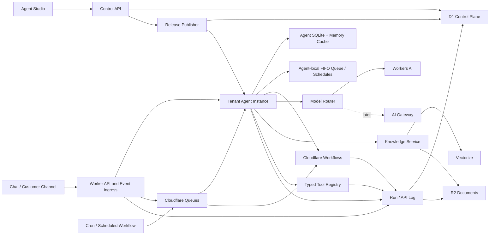

# Cloudflare Agent Framework — Technical Product Build Outline

Status: Target architecture; implementation scope is governed by the deep review  
Audience: Forward-deployed engineers, framework contributors, customer implementation teams, and coding agents  
Platform constraint: Cloudflare-only runtime and managed services  
Initial inference provider: Cloudflare Workers AI  
Future inference provider: Cloudflare AI Gateway routes and external-provider handoff

> **Implementation gate:** Read [`cloudflare-agent-framework-deep-review.md`](./cloudflare-agent-framework-deep-review.md) and [`mid-market-private-ai-product-requirements.md`](./mid-market-private-ai-product-requirements.md) before creating a build plan. This document describes the potential mature architecture. The product requirements make `AI Process` the customer-facing unit and define the aggressive MVP for a private AI operations platform. Full multi-tenant SaaS management, a general visual workflow builder, broad package extraction, and speculative platform features remain outside authorized v1 scope.

## 1. Product definition

Build an opinionated, reusable framework for delivering production AI agents to customers on Cloudflare. The framework must give a forward-deployed engineer a reliable starting point for:

- creating stateful agents;
- connecting customer systems through typed tools, webhooks, and events;
- composing and publishing prompts safely;
- attaching customer knowledge;
- running durable, observable workflows;
- introducing human approvals;
- selecting Cloudflare-hosted AI models by capability;
- managing tenants, users, roles, and permissions;
- inspecting and replaying every run; and
- handing a maintainable system to the customer.

The framework is both a usable open-source project and the foundation for customer solution packs, demonstrations, tutorials, and media content.

### 1.1 Primary users

1. **Forward-deployed engineer (FDE):** installs the framework, configures a customer, adds tools and workflows, tests behavior, and performs handoff.
2. **Customer administrator:** manages users, agents, prompts, knowledge, integrations, policies, and releases.
3. **Operator:** supervises runs, handles approvals, investigates failures, and replays events.
4. **End user:** interacts with an agent through chat, an embedded experience, or a customer channel.
5. **Framework contributor:** adds reusable primitives, adapters, templates, and solution packs.

### 1.2 Product promise

An FDE should be able to start from the repository, configure Cloudflare resources, select a template, add a customer integration, and run an observable agent workflow without designing infrastructure from scratch.

## 2. Goals and non-goals

### 2.1 Goals

- One coherent Cloudflare Agents SDK runtime rather than a public runner/agent split.
- Strong multi-tenant boundaries from the first migration.
- Fast prompt access through Agent-local caching with one authoritative database.
- Versioned, reproducible agent definitions and prompt releases.
- Durable workflows for work that can retry, wait, or require approval.
- A complete run and API log suitable for debugging and customer support.
- Workers AI model choice through stable capability profiles.
- A polished Agent Studio that is useful beyond a demonstration.
- Extension points that do not require edits to framework core.
- Local development, automated tests, and repeatable Cloudflare provisioning.

### 2.2 Non-goals for v1

- A general-purpose no-code automation competitor.
- Arbitrary customer code execution.
- An open marketplace with unreviewed third-party packages.
- Multi-cloud runtime portability.
- Automatic cross-provider model optimization.
- Autonomous production changes without explicit policy and approval.
- Complex loops and unrestricted graph cycles in the visual builder.

## 3. Architectural decisions

### ADR-001: One logical agent platform

The initial product deploys one primary Worker application containing the public API, admin API, event ingress, Agent classes, tool registry, and workflow entrypoints. Code remains separated into packages and modules so high-volume ingress or administration can later become separate Workers through service bindings.

The product does not expose `runner` and `agent` as separate concepts. Users see agents, tools, triggers, workflows, knowledge bases, policies, and runs.

### ADR-002: Agents and Workflows have different jobs

- Cloudflare Agent instances are durable, addressable actors—not continuously running processes. They wake for requests, messages, schedules, and events; own conversational state, real-time connections, colocated SQL state, and quick tool calls; then hibernate with no active compute.
- Cloudflare Workflows own durable multi-step execution, retryable pipelines, waits, external events, and human approval flows.
- Agent `keepAlive` and the protections built into `AIChatAgent` cover active streams and short operations. Fibers cover recoverable work that belongs to the Agent's own lifecycle. A discrete pipeline expected to exceed 30 seconds, wait for external input, require step retries, or require independent recoverability must use a Workflow.
- The originating Agent receives workflow progress and publishes it to connected clients.

### ADR-003: D1 is the control plane

D1 stores tenant-scoped definitions and operational indexes:

- tenants, users, memberships, roles, and permissions;
- agent definitions and versions;
- prompt modules, drafts, and published releases;
- model profiles and policies;
- tools and workflow definitions;
- integration metadata and secret references;
- knowledge-base metadata;
- run indexes, API logs, audit events, and retention settings.

D1 is not queried repeatedly for prompt text during an active conversation. Prompt bundles are indexed and stored as one row per immutable release so initialization reads do not scan module tables.

### ADR-004: D1 is authoritative; Agents cache locally

D1 is the only prompt and release store. Publishing creates an immutable, content-addressed prompt bundle in D1. Agent instances persist their assigned bundle in colocated Agent SQLite and may also retain a parsed copy in ephemeral memory during an activation.

Normal turns do not read D1 for prompt text. At session creation, the control path performs one indexed D1 row read for the exact immutable bundle and passes it to the name-addressed Agent. The Agent verifies the release and content hash and saves it to colocated SQLite. Later activations—including activations after eviction—reload it from the Agent's own persistent SQL. This favors operational simplicity while retaining a fast execution path.

This preserves low-latency reads while making releases auditable, reproducible, and recoverable.

### ADR-005: Model profiles hide model IDs

Agent definitions reference capability profiles such as `fast`, `balanced`, `reasoning`, `vision`, and `embedding`. A profile resolves to a versioned Workers AI model and its supported parameters. Model IDs are not scattered across agent or workflow code.

### ADR-006: Every execution is pinned

Every run records immutable versions for:

- agent definition;
- prompt bundle;
- workflow definition;
- tool schemas;
- model profile;
- knowledge-base snapshot or index version; and
- policy bundle.

Replays default to the original versions. Operators may explicitly choose “replay with current versions.”

### ADR-007: Definition, instance, session, and run are different identities

An agent definition is a reusable blueprint. It is not a singleton runtime actor. One published definition may create many independently addressed Agent instances serving many consumers.

Every definition declares an execution profile that determines whether work is sticky, what key selects an instance, and whether the Agents SDK is used at all:

| Execution profile | Runtime | Instance key | Sticky state | Primary use |
| --- | --- | --- | --- | --- |
| `conversation` | Agents SDK | tenant + definition + conversation/session | Yes | Threaded chat, ongoing customer interaction |
| `consumer` | Agents SDK | tenant + definition + consumer | Yes | Personal assistant with memory across threads |
| `entity` | Agents SDK | tenant + definition + entity | Yes | Case, account, project, device, or order agent |
| `shared_shard` | Agents SDK | tenant + definition + deterministic shard | Yes, multiplexed | High-volume shared coordination with bounded sharding |
| `temporary_durable` | Agents SDK | tenant + definition + run | Until retention cleanup | Recoverable short-lived agent work or detached sub-agent |
| `instant` | Stateless Worker code | none | No | Classification, extraction, transformation, one-shot response |
| `workflow` | Cloudflare Workflow | workflow instance ID | Step durability | Independent multi-step pipeline, wait, retry, approval |

The term “instant agent” is a product-facing convenience. Internally it is a stateless inference/processing invocation, not a fake non-durable Agents SDK object. All actual Cloudflare Agent instances are Durable Object-backed durable actors, even if their retention is short.

The router must derive instance identity from authenticated context and the definition's execution profile. Clients may supply a conversation or entity reference, but cannot supply an arbitrary raw Agent instance name.

### ADR-008: Use the smallest Cloudflare execution primitive that fits

The framework supports several Cloudflare execution mechanisms but does not treat them as interchangeable:

| Need | Primitive | Durability/order | Framework use |
| --- | --- | --- | --- |
| Immediate bounded stateless work | Worker request | Request lifetime | Instant classification, extraction, routing |
| Ordered background work for one Agent | Agents SDK local queue | Agent SQLite, FIFO, sequential | Process pending work belonging to one sticky actor |
| One Agent wakes later or recurringly | Agent schedule | Agent SQLite | Follow-up, reminder, polling tied to that Agent |
| Cross-Agent burst buffering or fan-out | Cloudflare Queues | At-least-once, batching/retries, no global ordering guarantee | Webhook/event ingestion, indexing fan-out, telemetry buffering |
| Durable dependent steps, waits, or approvals | Cloudflare Workflows / `AgentWorkflow` | Durable step results, retries, waits/events | Customer operations pipelines |
| Deployment-wide periodic dispatch or maintenance | Cron Trigger or scheduled Workflow | Scheduled invocation | Retention sweeps, global reconciliation, periodic dispatch |

Rules:

- Agent-local queues are private to an Agent instance and sequential. They are not a replacement for platform Queues.
- Platform Queue consumers must be idempotent because delivery is at least once and messages may arrive more than once or out of order.
- A Queue message carries an event envelope and canonical target identity; its consumer routes to an Agent, starts a Workflow, or performs stateless processing.
- Cron does not scan and execute every Agent's schedule. Agent-specific timing uses Agent schedules.
- Cron handlers stay small and dispatch durable work rather than performing large jobs inline.
- Workflows orchestrate dependencies; Queues absorb and distribute load. A Queue may start a Workflow, and a Workflow may publish independent fan-out work to a Queue.

## 4. Target architecture



### 4.1 Cloudflare product allocation

| Concern | Cloudflare product | Responsibility |
| --- | --- | --- |
| HTTP API and static application | Workers with static assets | Admin and runtime endpoints |
| Stateful agent identity | Agents SDK / Durable Objects | Per-agent or per-session execution and SQL |
| Durable processing | Workflows | Retries, waits, approvals, multi-step work |
| Control-plane database | D1 | Tenant definitions, versions, indexes, RBAC |
| Published prompts | D1 plus Agent-local SQL | Immutable releases and fast per-Agent access |
| Source documents | R2 | Original files, extracted text, large payloads |
| Semantic retrieval | Vectorize | Tenant-filtered embeddings and retrieval |
| Native inference | Workers AI | LLM, embeddings, vision, and related models |
| Future inference routing | AI Gateway | Provider routing, fallbacks, budgets, analytics |
| Async event buffering | Queues when needed | Burst absorption and fan-out |
| Agent-local ordered tasks | Agents SDK queue | Per-actor FIFO work stored in Agent SQL |
| Agent-local timing | Agents SDK schedules | Delayed and recurring wake-ups for one Agent |
| Global periodic dispatch | Cron Triggers / Workflow schedules | Maintenance and deployment-wide dispatch |
| Secrets | Worker secrets / Secrets Store where applicable | Credentials; never D1 or client bundles |
| Metrics and runtime logs | Workers observability plus product logs | Platform and business-level diagnostics |

## 5. Prompt and context architecture

### 5.1 Performance premise

Prompt performance has two different costs:

1. **Retrieval and assembly latency:** fetching prompt configuration and composing the request.
2. **Inference latency and cost:** sending more input tokens to the model.

Agent-local memory and SQL handle the first cost. Selective composition, context limits, summaries, and retrieval quality control the second. As prompt content grows, token count normally becomes the more important constraint than the occasional cold D1 read.

The framework therefore optimizes both independently.

### 5.2 Two storage layers

#### Authoring and publication layer — D1

D1 stores editable modules, drafts, labels, metadata, test cases, release history, and immutable published bundles. It provides transactions and administrative queries. Publishing builds one canonical bundle row for each tenant/agent/release.

The bundle contains all small, frequently used runtime configuration in one read:

```json
{
  "schemaVersion": 1,
  "releaseId": "rel_...",
  "contentHash": "sha256:...",
  "agentVersion": 4,
  "core": "...",
  "modules": {
    "tone": "...",
    "safety": "...",
    "pricing": "..."
  },
  "routing": {
    "always": ["tone", "safety"],
    "topics": {
      "pricing": ["pricing"]
    }
  },
  "toolPolicyVersion": 3,
  "modelProfile": "balanced",
  "knowledgeBindings": ["kb_product_manual"]
}
```

Bundles are immutable. Publishing never overwrites an existing release row. Rollback changes the active release reference and not the historical bundle.

#### Execution layer — Agent SQLite with optional isolate memory

The Agent receives its pinned immutable bundle at session initialization, validates its hash/schema, and persists the release ID and bundle in colocated SQL. It may retain the parsed object in isolate memory during one activation or a warm period, but correctness and performance assumptions must not require that memory to remain present.

Read precedence:

1. parsed in-memory bundle when incidentally available within the activation;
2. matching bundle in Agent SQLite;
3. one indexed immutable D1 bundle read only during initialization or controlled recovery.

Normal turns perform no external prompt-storage read.

### 5.3 Consistency model

The publish transaction follows this sequence:

1. Validate modules, tool references, policies, token budget, and the exact allowlisted Workers AI model selected from the authoring profile.
2. Create a release row in D1 with status `publishing`.
3. Build a canonical bundle and calculate its content hash.
4. Insert the immutable bundle and manifest in D1.
5. Read the stored bundle back and verify schema and hash.
6. Mark the release `published` and update the active release in the same transaction where practical.
7. New sessions resolve and receive the new active release.
8. Existing sessions remain pinned unless an explicit or safety-forced migration supplies the new exact bundle to the Agent and records the transition.

Requests are pinned to a release ID at run creation. They never depend on mutable prompt content.

The release bundle also contains the exact Workers AI model ID. Profile names such as `fast`, `balanced`, and `reasoning` are authoring conveniences; changing their mapping affects only newly created drafts. Instant, Agent, Workflow, evaluation, export, and rollback paths use the model stored with the release, and reject model IDs outside the platform allowlist. Each tenant also has an owner-managed approval policy. Draft, publish, rollback, and evaluation control paths enforce it; removal is blocked while an active release or known durable actor remains pinned to the model. The execution path trusts that deployment invariant, avoiding a D1 policy read on every agent turn.

For durable profiles, the Agent actor stores the installed process-release ID separately from its local prompt-release ID, and the process release wins over the blueprint's newer active release on later turns. The Worker resolves that tenant-scoped immutable release before validating contracts or invoking tools. A legacy actor with only a prompt-release ID is adopted into the dual-ID state only after D1 proves that prompt belongs to the same tenant, process, and immutable process release. For Workflow profiles, the execution row's admission-time release wins on every retry. Neither path silently upgrades in-flight or conversational work.

An explicit actor migration is an operator action, not a side effect of publication. It uses optimistic source-release confirmation, permits only the current published and evaluated target, installs the target prompt bundle inside the serialized Agent actor, retains governed conversation turns, and records tenant-scoped from/to evidence and rationale in D1 and the audit log.

Fleet adoption is computed from D1 control-plane evidence rather than Durable Object enumeration. For each known instance key, the latest execution release is reconciled with any later explicit migration. Process Studio aggregates the resulting actors by release and highlights current, pinned-previous, and unattributed cohorts. This query runs only when an operator opens Studio; it is not part of the agent request path.

Fleet migration is a separate Cloudflare Workflow binding. Rollout admission snapshots a deterministic, bounded subset of attributable pinned actors only after the target release is published and has passing evaluation evidence. Each Workflow step invokes one named Agent actor, whose Durable Object serialization enforces its optimistic source-release check. D1 keeps the immutable cohort, item outcomes, aggregate status, and initiating operator; partial completion remains visible and does not roll back actors that migrated successfully.

If an Agent has not received the publication event, it may finish in-flight runs on the previous release. New run creation supplies the intended release ID. This gives deterministic behavior with a single authoritative prompt store.

### 5.4 Prompt composition

Prompt modules have explicit roles:

- `core`: invariant identity and primary objective;
- `policy`: safety, compliance, and customer constraints;
- `persona`: tone and communication rules;
- `domain`: customer or industry instructions;
- `task`: task-specific instructions;
- `tool`: generated tool-use guidance;
- `memory`: selected session/customer memory;
- `knowledge`: retrieved evidence;
- `output`: output schema and validation constraints.

Only `core` and mandatory policy modules are always included. A lightweight deterministic router or classifier selects optional modules. Retrieval adds bounded evidence rather than whole documents.

### 5.5 Context budget

Every model profile defines budgets, not just a model name:

```ts
type ContextBudget = {
  maxInputTokens: number;
  reservedOutputTokens: number;
  corePromptTokens: number;
  optionalPromptTokens: number;
  memoryTokens: number;
  retrievalTokens: number;
  conversationTokens: number;
};
```

Assembly priority is:

1. safety and policy;
2. current user request;
3. output and tool contracts;
4. core agent instructions;
5. relevant recent conversation;
6. selected customer memory;
7. retrieved knowledge;
8. optional domain/persona modules.

Content is truncated or summarized by section, never by cutting the final combined prompt blindly.

### 5.6 Prompt performance instrumentation

Each run records:

- bundle source: `session_init`, `agent_sql`, `memory`, or `d1_recovery`;
- bundle load and parse duration;
- release and content hash;
- selected module IDs;
- token count by prompt section;
- retrieval duration and returned token count;
- model time to first token and total duration;
- cached versus uncached inference where supported.

Initial engineering targets, to be validated with load tests:

- normal prompt bundle lookup: Agent-local SQL or already-parsed activation memory, with no D1 operation;
- one indexed D1 bundle-row read when creating a conversation session;
- no D1 prompt read merely because Cloudflare evicted and later reactivated an existing Agent;
- one compiled bundle read rather than one query per prompt module;
- prompt assembly below 5% of median end-to-end inference latency;
- no optional module included without a routing reason recorded in the trace.

### 5.7 Repeated requests and conversation memory

The model is stateless. The framework reconstructs the model input on every turn from a pinned prompt release plus selected conversation state. It does not resend every stored item blindly.

#### Agent instance naming

Conversational agents default to one Agent instance per conversation session:

```text
agent instance name = {tenantId}:{agentId}:{sessionId}
```

This gives each conversation a single strongly ordered execution owner and its own colocated SQLite database. Separate conversations run independently and scale across Agent instances. Non-conversational jobs use a run or business-entity identifier instead of `sessionId` when that gives the work a stable identity.

The same published definition is therefore duplicated as many runtime actors:

```text
support-agent definition v7
  ├── tenant-a:support-agent:conversation-1001
  ├── tenant-a:support-agent:conversation-1002
  ├── tenant-a:support-agent:conversation-1003
  └── tenant-b:support-agent:conversation-9001
```

Each instance has isolated Agent SQL and lifecycle. They share immutable definition/release IDs, not memory or conversation rows.

#### Stickiness policy

Stickiness is explicit metadata on an agent definition:

```ts
type ExecutionProfile =
  | { mode: "conversation"; releasePolicy: "pin" | "follow_compatible" }
  | { mode: "consumer"; consumerKey: "user" | "customer" }
  | { mode: "entity"; entityType: string }
  | { mode: "shared_shard"; shardCount: number; partitionBy: string }
  | { mode: "temporary_durable"; retentionSeconds: number }
  | { mode: "instant" }
  | { mode: "workflow"; workflowType: string };
```

The router produces the canonical name. A threaded conversation always routes back to the same `conversation` instance. A consumer-sticky assistant may route several conversation threads to one consumer instance while keeping thread IDs separate inside its SQL. An `instant` invocation never creates or addresses an Agent instance.

Choose the narrowest durable scope that matches the product promise:

- use conversation stickiness when memory should not cross threads;
- use consumer stickiness only when cross-thread personal memory is intentional;
- use entity stickiness when the business object is the enduring actor;
- use shared shards only for coordination where multiplexing and contention are understood;
- use instant execution when there is no reason to remember or recover;
- use a Workflow when step durability matters more than interactive identity.

#### Instant, non-sticky processing

An instant execution receives a complete validated request, resolves its pinned definition/model/policy version, performs bounded inference or transformation, writes only the requested product trace, and returns. It has:

- no Agent instance name;
- no Agent SQLite;
- no conversation memory;
- no WebSocket or resumable Agent session;
- no promise of recovery after the request ends.

Good candidates include intent classification, structured extraction, moderation, routing, short summarization, and deterministic prompt assembly. If the caller needs retries, delayed continuation, approval, or recovery, the work must be promoted to a Workflow or temporary durable Agent.

#### First turn in a new conversation

1. The API authenticates the actor and tenant.
2. It creates a session and pins the current agent, prompt, model-profile, policy, tool, and knowledge release IDs.
3. It routes to the named Agent instance.
4. The session-creation path reads the exact immutable prompt bundle from D1 using its indexed release ID. The bundle is stored as one D1 row, so this reads approximately one row rather than scanning all prompt modules.
5. The API passes the pinned bundle to the name-addressed Agent during initialization.
6. The Agent validates the content hash and writes the bundle to local SQLite.
7. The parsed bundle may remain in memory during the current activation, but no later request assumes it will still be there.
8. The user message and resulting assistant/tool messages are appended to local SQLite.

#### Repeated turns in the same conversation

Subsequent requests route to the same named Agent instance.

- Prompt bundle: read from the Agent's persistent local SQLite; a parsed in-memory value may avoid repeated parsing within a warm activation.
- After eviction: Cloudflare recreates the compute instance and the Agent reads the same persistent local SQLite state.
- Conversation history: query the Agent's local SQLite database.
- Active working state: keep only small counters, status, approval state, and current run references in synchronized Agent state.
- D1: used for control-plane/run records when needed, not to reload prompt text each turn.

The Durable Object execution model serializes conflicting work for one instance, which prevents two simultaneous turns from corrupting conversation order. Different conversations do not block one another.

#### Building model context on each turn

Stored conversation history and model context are not the same. Local SQL may retain the full authorized history, while the context assembler selects a bounded input:

```text
mandatory prompt modules
+ session summary
+ durable customer facts allowed for this agent
+ most recent relevant messages
+ unresolved tool/approval state
+ bounded knowledge retrieval
+ current user message
```

When recent messages cross a configured token threshold, a background or durable summarization step produces a versioned session summary. Old messages remain available for audit and targeted retrieval, but they are no longer included verbatim on every turn.

The MVP uses these conversation tables inside each Agent instance:

- `governed_memory`: ordered user/assistant turns with correction, quarantine, and deletion state;
- `durable_fact`: explicit facts with source-turn/execution provenance, allowlisted category, proposal/approval state, revision, and expiry;
- `pending_actions`: tools, external events, and approvals awaiting completion;
- `prompt_bundle`: immutable prompt bundles used by this conversation;
- `actor_local_work`: queued and scheduled work owned by this actor.

Rolling summaries are not produced automatically in the MVP. Context remains deterministically bounded to 20 recent active turns and 24,000 characters. Long-term facts are likewise never inferred: an authorized operator proposes one from an active source turn, tenant DLP protects it, and a separate governed action approves it. Only 20 unexpired active facts and 4,000 fact characters may enter a turn. Corrections return a fact to proposal; retirement and expiry remove it immediately. Fact text stays in actor SQLite while D1 receives metadata-only audit evidence.

#### Many conversations using the same agent definition

Each conversation Agent instance keeps its own local copy of the pinned prompt bundle. This duplicates a relatively small compiled bundle, but removes D1 from normal turns and keeps the design aligned with the Agents SDK. D1 sees approximately one indexed row read per new conversation, not one read per Agent activation or message.

This tradeoff should be measured through D1 query metadata (`rows_read`) and product telemetry. D1 charges by rows read/scanned, not by `SELECT` count or bundle byte size. Indexes on `(tenant_id, agent_id, release_id)` and the one-row compiled bundle keep the initialization charge predictable. If an unusually high volume of short, one-turn sessions makes that single-row initialization read material, optimization can occur behind the bundle repository without changing session or Agent contracts.

#### Prompt publication during a conversation

By default, an existing conversation remains pinned to the prompt release with which it started. This makes behavior reproducible and avoids changing instructions in the middle of a customer interaction.

- New conversations use the newly active release.
- Existing conversations continue using their pinned local bundle.
- An administrator may explicitly migrate a conversation to a newer compatible release.
- A critical safety release may be marked `force_upgrade`; the next turn loads that exact release, records the transition, and invalidates the parsed in-memory bundle.

#### Eviction and recovery

Worker and Agent compute are ephemeral. Isolate memory is an optimization and may disappear at any time. Correctness never depends on it, and an Agent is never described or designed as an always-running service.

After eviction, the same name-addressed Agent is reconstructed with the same persistent SQLite storage. It reloads its pinned release and recent state locally. If the local bundle is missing or its hash fails validation, a controlled recovery reads the exact indexed D1 release and repairs local storage. The full conversation therefore survives eviction, deploys, and periods of inactivity without keeping compute alive.

#### Memory scopes

The framework distinguishes four scopes:

| Scope | Storage | Examples |
| --- | --- | --- |
| Turn working state | ephemeral memory / small durable Agent state | current tool call, stream status |
| Conversation memory | Agent SQLite | messages, summary, pending approvals |
| Customer/tenant memory | D1 and optionally Vectorize | future shared preferences and verified business facts |
| Source knowledge | R2 and Vectorize | manuals, policies, documents |

Agents may read broader memory only through tenant- and permission-aware services. Actor facts remain scoped to one Durable Agent identity and are not silently promoted into customer/tenant memory. Any future cross-actor promotion requires a separate explicit policy and source evidence.

## 6. Core domain model

All tenant-owned tables include `tenant_id`, creation/update timestamps, and archival fields where appropriate. IDs are generated with `crypto.randomUUID()` or a typed wrapper around it.

### 6.1 Identity and access

- `tenants`
- `users`
- `memberships`
- `roles`
- `permissions`
- `role_permissions`
- `membership_roles`
- `sessions`
- `api_keys`
- `audit_events`

Permissions are capabilities, for example:

- `agents.view`, `agents.manage`, `agents.publish`
- `prompts.view`, `prompts.edit`, `prompts.publish`
- `knowledge.view`, `knowledge.manage`
- `tools.view`, `tools.manage`, `tools.approve`
- `workflows.view`, `workflows.manage`, `workflows.run`
- `runs.view`, `runs.replay`, `runs.cancel`
- `integrations.view`, `integrations.manage`
- `users.manage`, `roles.manage`, `settings.manage`

Authorization is enforced server-side at route and resource scope. A UI check is never the security boundary.

### 6.2 Agent configuration

- `agents`
- `agent_versions`
- `agent_execution_profiles`
- `agent_instance_registry` (optional operational index; Agent identity remains canonical in the Agents runtime)
- `prompt_modules`
- `prompt_module_versions`
- `prompt_releases`
- `prompt_release_modules`
- `model_profiles`
- `agent_model_profiles`
- `policy_bundles`
- `agent_policy_bundles`
- `agent_knowledge_bindings`
- `agent_tool_bindings`

### 6.3 Tools and integrations

- `tools`
- `tool_versions`
- `integrations`
- `integration_secret_refs`
- `tool_invocations`
- `approval_requests`
- `approval_decisions`

Secrets are referenced by logical name only. Secret values never enter D1, traces, exported templates, or browser bundles.

### 6.4 Workflows and events

- `workflow_definitions`
- `workflow_versions`
- `workflow_triggers`
- `workflow_runs`
- `workflow_run_steps`
- `event_receipts`
- `idempotency_keys`
- `dead_letters`
- `queue_receipts` (product-level idempotency/audit only; Cloudflare owns queue delivery state)
- `scheduled_dispatches`

Supported v1 triggers:

- manual;
- webhook;
- schedule;
- internal event;
- agent tool or callable method.
- Cloudflare Queue message;
- deployment Cron Trigger or scheduled Workflow.

Supported v1 workflow nodes:

- agent turn;
- invoke typed tool;
- HTTP request;
- transform/validate data;
- condition;
- wait/delay;
- wait for external event;
- human approval;
- emit event;
- end success/failure.

Loops and arbitrary cycles remain unavailable in v1.

### 6.5 Knowledge

- `knowledge_bases`
- `knowledge_sources`
- `knowledge_documents`
- `knowledge_ingestion_jobs`
- `knowledge_chunks`
- `knowledge_releases`

Customer-managed ingestion connectors may retain original files in R2 only when that retention is explicitly configured. Direct operator uploads keep the raw binary only for the bounded Workers AI conversion request; Workrr retains only DLP-protected extracted text in R2. D1 stores metadata, extraction method, size evidence, and lifecycle. Vectorize records include tenant, knowledge-base, document, release, and authorization metadata for filtering.

Direct knowledge onboarding accepts native text or supported PDF, Word, PowerPoint, Excel, HTML, and OpenDocument files. Uploads are bounded to 4 MB, converted output is bounded to 2 MB, and failed, empty, unsupported, or DLP-blocked input creates neither a source record nor retained input bytes. Queue performs chunking and embedding after admission so the interactive Worker remains short-lived and retryable.

### 6.6 Observability

- `runs`
- `run_events`
- `model_calls`
- `api_attempts`
- `webhook_receipts`
- `trace_artifacts`

Large or sensitive request/response bodies go to encrypted R2 objects with retention metadata. D1 keeps searchable summaries and object references.

## 7. Runtime contracts

### 7.1 Event envelope

```ts
type EventEnvelope<T = unknown> = {
  id: string;
  tenantId: string;
  type: string;
  source: string;
  schemaVersion: number;
  occurredAt: string;
  receivedAt: string;
  correlationId: string;
  causationId?: string;
  idempotencyKey?: string;
  actor?: { type: "user" | "agent" | "system" | "integration"; id?: string };
  data: T;
};
```

The same envelope crosses webhook, Queue, Agent, and Workflow boundaries. Queue consumers use `id` or `idempotencyKey` to deduplicate side effects. Ordering-sensitive events include an aggregate/entity key and monotonic source sequence where the source can provide one; otherwise the target Agent reconciles current state rather than assuming Queue order.

### 7.2 Run context

```ts
type RunContext = {
  runId: string;
  tenantId: string;
  agentId: string;
  agentVersion: number;
  executionMode: "conversation" | "consumer" | "entity" | "shared_shard" | "temporary_durable" | "instant" | "workflow";
  agentInstanceName?: string;
  consumerId?: string;
  conversationId?: string;
  entityRef?: { type: string; id: string };
  promptReleaseId: string;
  workflowVersionId?: string;
  modelProfileVersionId: string;
  policyBundleVersionId: string;
  correlationId: string;
  actor: EventEnvelope["actor"];
  deadline?: string;
};
```

### 7.3 Tool definition

```ts
type ToolDefinition<Input, Output> = {
  name: string;
  version: number;
  description: string;
  inputSchema: unknown;
  outputSchema: unknown;
  requiredPermission?: string;
  risk: "read" | "write" | "destructive" | "external-message";
  approval: "never" | "policy" | "always";
  timeoutMs: number;
  retryPolicy: RetryPolicy;
  execute(input: Input, context: ToolContext): Promise<Output>;
};
```

All input and output is runtime-validated. Tools receive scoped service bindings or integration clients rather than the entire environment.

### 7.4 Inference provider

```ts
interface InferenceProvider {
  generate(request: GenerateRequest, context: RunContext): Promise<GenerateResult>;
  stream(request: GenerateRequest, context: RunContext): Promise<ReadableStream>;
  embed(request: EmbedRequest, context: RunContext): Promise<EmbedResult>;
  capabilities(profile: string): ModelCapabilities;
}
```

V1 implements `WorkersAiProvider`. A later `AiGatewayProvider` implements the same interface without changing agent definitions.

## 8. API surface

Version all public APIs under `/api/v1`.

### 8.1 Authentication

- `POST /auth/login`
- `POST /auth/logout`
- `GET /auth/session`
- `POST /auth/refresh`
- `POST /auth/invitations/:token/accept`

The open-source default uses secure HTTP-only cookie sessions with hashed opaque session tokens. Enterprise identity adapters may add Cloudflare Access or an external OIDC provider.

### 8.2 Agent and prompt administration

- CRUD `/tenants/:tenantId/agents`
- CRUD `/tenants/:tenantId/agents/:agentId/versions`
- CRUD `/tenants/:tenantId/prompt-modules`
- `POST .../prompt-releases/validate`
- `POST .../prompt-releases/publish`
- `POST .../prompt-releases/:releaseId/activate`
- `POST .../prompt-releases/:releaseId/rollback`
- `POST .../agents/:agentId/test`

### 8.3 Runtime

- `POST /agents/:agentId/runs`
- `GET /agents/:agentId/sessions/:sessionId`
- `GET /agents/:agentId/connect` for WebSocket/streaming transport
- callable methods exposed through the Agents client SDK where appropriate

### 8.4 Workflows and events

- CRUD `/tenants/:tenantId/workflows`
- `POST .../workflows/:workflowId/validate`
- `POST .../workflows/:workflowId/publish`
- `POST .../workflows/:workflowId/run`
- `POST /hooks/:tenantSlug/:endpointId`
- `POST /events/:tenantId`

Queue producers and consumers are internal bindings, not public HTTP endpoints. The admin exposes queue/DLQ health and replay controls without exposing raw queue mutation to ordinary users.

Webhook endpoints verify provider signatures or a rotatable endpoint secret, record the receipt before processing, enforce idempotency, and return quickly. Durable work is handed to a Workflow or Queue.

### 8.5 Logs and replay

- `GET /tenants/:tenantId/runs`
- `GET /tenants/:tenantId/runs/:runId`
- `GET /tenants/:tenantId/runs/:runId/events`
- `POST /tenants/:tenantId/runs/:runId/replay`
- `GET /tenants/:tenantId/api-attempts`
- `GET /tenants/:tenantId/api-attempts/:attemptId`

## 9. Agent Studio UX

### 9.1 Navigation

- Overview
- Agents
- Workflows
- Knowledge
- Tools and integrations
- Approvals
- Runs
- API log
- Models
- Users and roles
- Settings

### 9.2 Agent editor

The editor has four coordinated surfaces:

1. **Canvas:** nodes and edges for triggers, agents, tools, conditions, approvals, waits, and workflow calls.
2. **Inspector:** typed configuration for the selected node.
3. **Test console:** sample input, chat, expected output, assertions, and trace.
4. **Run drawer:** live execution timeline with timings and payload previews.

### 9.3 Visual language

- Trigger nodes are blue.
- Agent/model nodes are violet.
- Tool/integration nodes are cyan.
- Condition and transformation nodes are amber.
- Approval nodes are orange.
- Storage/knowledge nodes are green.
- Failure paths are red and visually distinct.

Each node shows status, median duration, recent failure rate, and the version used. The canvas must remain useful as an operational view after publishing, not become a static illustration.

### 9.4 Release workflow

Draft → Validate → Test → Publish → Observe → Roll back.

Validation checks references, schemas, permissions, cycles, missing secrets, model capabilities, prompt token budgets, and knowledge bindings. Publishing creates immutable versions. Rollback activates a prior release without deleting later history.

## 10. Repository structure

```text
/
  apps/
    platform-worker/          # Worker entrypoint, routing, bindings
    admin/                    # React Agent Studio
  packages/
    contracts/                # Shared schemas and public TypeScript contracts
    control-plane/            # D1 repositories and services
    agent-runtime/            # Agents SDK base classes and lifecycle
    prompt-runtime/           # Bundle compiler, loader, cache, composition
    model-router/             # Model profiles and Workers AI provider
    tool-runtime/             # Tool registry, validation, policy, approvals
    workflow-runtime/         # AgentWorkflow classes and node execution
    event-runtime/            # Webhook verification, envelopes, idempotency
    knowledge-runtime/        # R2 ingestion, chunking, Vectorize retrieval
    observability/            # Traces, API log, redaction, retention
    auth/                     # Sessions, RBAC, tenant guards
    ui-kit/                   # Shared visual system
  solution-packs/
    starter-support-agent/
    starter-document-intake/
  migrations/
  tests/
    contract/
    integration/
    e2e/
    load/
  docs/
    architecture/
    fde/
    contributing/
```

No package imports from an app. Package dependencies must be acyclic. `contracts` contains no Cloudflare runtime logic.

## 11. Security and tenancy

- Derive tenant scope from authenticated membership or endpoint identity; never trust a body-provided tenant ID by itself.
- Include `tenant_id` in every control-plane query and composite uniqueness constraint.
- Filter every Vectorize query by tenant and allowed knowledge release.
- Place all credentials in Cloudflare-managed secrets.
- Use timing-safe secret comparisons where signatures cannot be verified by a provider SDK.
- Redact authorization headers, cookies, credentials, and configured sensitive JSON paths before logging.
- Record all definition, permission, secret-reference, release, replay, and approval changes in the audit log.
- Require approval policies for destructive writes and external communications by default.
- Apply rate limits and payload-size limits to login, webhook, test, chat, and replay endpoints.
- Use Content Security Policy, secure cookies, CSRF protection for cookie-authenticated mutations, and strict CORS allowlists.
- Define data retention separately for searchable metadata, full payloads, conversations, and customer knowledge.

## 12. Observability design

The product log complements Cloudflare platform logs. It must answer:

- What started this run?
- Which version of every definition was used?
- Which prompt modules and knowledge chunks were included?
- Which model was called, with what token and timing totals?
- Which tools ran, under what actor and permission?
- Was an approval required, and who decided it?
- Which external APIs were called and what happened?
- Where did a retry or fallback occur?
- Can the original input be replayed safely?
- Was work dispatched through an Agent queue, platform Queue, schedule, Cron, or Workflow?
- What delivery attempt, idempotency decision, batch, Workflow instance, or Agent target handled it?

The unified API log records inbound and outbound attempts with direction, provider, endpoint, correlation ID, status, duration, retry count, signature result, idempotency result, and redacted payload references.

Run events are append-only. Summary rows may be updated for fast lists, but historical events are not rewritten.

## 13. Testing strategy

### 13.1 Unit and contract tests

- Schema validation and backward compatibility.
- Prompt canonicalization, hashing, selection, budgeting, and truncation.
- Model-profile capability checks.
- Tenant and permission guards.
- Tool approval and retry policies.
- Event signatures, idempotency, and redaction.
- Workflow graph validation.

### 13.2 Integration tests

- D1 migrations and repository tenant isolation.
- D1 publish/read/rollback lifecycle.
- Agent memory → SQLite → D1 cold-start behavior.
- Agent-to-Workflow progress updates.
- Agent-local FIFO queue persistence across activation.
- Cloudflare Queue duplicate/out-of-order delivery, per-message acknowledgement, retry, and DLQ behavior.
- Cron/scheduled dispatcher idempotency and handoff to Queue or Workflow.
- R2 ingestion and tenant-filtered Vectorize retrieval.
- Workers AI provider using deterministic test doubles and selected live smoke tests.

### 13.3 End-to-end tests

- Login, tenant selection, and RBAC.
- Create an agent, edit modules, validate, test, and publish.
- Trigger by webhook, execute a tool, pause for approval, and complete.
- Inspect run and API logs.
- Replay with original and current releases.
- Roll back and verify subsequent runs use the restored release.

### 13.4 Load and failure tests

- Warm and cold prompt-bundle latency.
- Concurrent sessions for one tenant and across tenants.
- Webhook bursts and duplicate delivery.
- Agent cache miss, D1 delay, Vectorize failure, model timeout, and tool timeout.
- Workflow retry and recovery after Worker/Agent eviction.
- Large prompt modules and context-budget enforcement.

## 14. Delivery phases

### Phase 0 — Foundation and decisions

Deliverables:

- monorepo scaffold and dependency rules;
- Wrangler configuration and generated binding types;
- local development bootstrap;
- initial D1 migrations;
- shared contracts and error format;
- architecture decision records;
- CI for typecheck, lint, tests, migration checks, and secret scanning.

Exit criteria: a fresh clone can provision local resources, migrate D1, run Worker and admin UI, and pass CI.

### Phase 1 — Vertical slice

Deliverables:

- login, sessions, one tenant, and RBAC;
- agent CRUD and immutable versioning;
- prompt modules, D1 bundle publisher, Agent cache hierarchy;
- Workers AI model profiles;
- streaming agent test console;
- one typed read tool and one approval-gated write tool;
- run timeline and unified API log;
- one webhook-triggered durable workflow.
- Queue-backed webhook handoff with idempotency and a configured DLQ.
- one Agent-local queued task and one Agent schedule to prove the actor-local patterns.

Implemented boundary: the Activity and API surfaces accept an execution ID only. The Worker verifies tenant ownership, resolves the persisted instance key, and permits Agent-local FIFO work and schedules only for `conversation`, `consumer`, `entity`, `shared_shard`, and `temporary_durable` profiles. Descriptions are DLP-filtered before entering Agent SQLite. Cloudflare Agents SDK queue/schedule records survive isolate eviction; cancellation and actor retirement clean up native schedules and queued callbacks. A due follow-up emits an owned operational notification, while `instant` and `workflow` profiles remain intentionally non-sticky.

Exit criteria: an administrator can build, publish, run, approve, inspect, replay, and roll back a complete agent flow.

### Phase 2 — FDE usability

Deliverables:

- workflow canvas and typed node inspector;
- solution-pack format and two starter packs;
- integration credential setup flow;
- knowledge ingestion through R2 and Vectorize;
- tenant onboarding wizard;
- CLI for initialization, validation, provisioning, and seed data;
- FDE discovery, build, test, deployment, and handoff guides.
- a tenant-scoped customer handoff gate that keeps automated Cloudflare preflight evidence distinct
  from attributable customer acceptance, data-owner approval, operator training, support transfer,
  and recovery-exercise sign-off.
- explicit provider acceptance runs for code-owned read-only endpoints, with capability/scope,
  HTTP outcome, and latency evidence but no provider payload retention.
- native Worker version metadata and an exact additive-migration compatibility check visible in the
  customer handoff surface, with no dependency on agent hot paths.

Exit criteria: an FDE can configure a new customer without modifying framework core.

### Phase 3 — Scale and governance

Deliverables:

- quotas, retention, cost and token reporting;
- advanced approval policies;
- audit export;
- queue-backed burst handling;
- evaluation suites and release gates;
- prompt/model A/B release support;
- performance dashboards and SLO alerts.

Cost governance has two nested monthly boundaries. A tenant budget always applies, and an owner may optionally allocate a lower budget to one process. Both use captured Workers AI cost evidence from operations and evaluation cases. Hard limits are checked at synchronous admission and again inside delayed Workflow/evaluation steps immediately before model use; warning-only policies remain visible without blocking. The boundary is intentionally a settled-evidence guardrail rather than a distributed prepaid reservation system, so bounded parallel calls may settle just beyond it.

Hourly Cron evaluates budget thresholds through one bounded aggregate query and creates owned notification tasks without inference. A receipt keyed by tenant, scope, calendar month, and warning/hard-limit stage provides race-safe deduplication. Claims are released when no enabled routing policy creates an event, preserving recoverability after customer configuration changes. Notification evidence carries allocation metadata only and routes the operator back to Usage.

Exit criteria: multiple tenants can operate with measurable isolation, reliability, and cost controls.

Customer governance uses recurring control-plane reviews rather than informal calendar reminders. Each tenant receives quarterly privacy/architecture, model inventory, access/role, and incident/recovery obligations. Due or overdue reviews degrade readiness; accountable completion requires an evidence reference and notes, advances the next due date, and emits audit evidence. These records are queried only by governance surfaces and never by agent hot paths.

The hourly scheduled dispatcher scans a bounded 14-day review horizon and routes due work through the normal notification policy. A D1 receipt keyed to the exact review due cycle and due/overdue stage makes overlapping Cron invocations idempotent while permitting one distinct overdue escalation. Failed or unroutable notification claims are released for later recovery; no inference or reviewed business content is involved.

### Phase 4 — AI Gateway handoff

Implemented MVP boundary: the tenant Gateway is disabled by default, requires owner privacy/billing evidence, and gates a separately approved curated external model. Native Workers AI remains the no-read default. External immutable releases use Cloudflare-managed Unified Billing, bypass response caching, preserve Agent/Workflow/tool behavior, and persist bounded Gateway routing evidence. BYOK, multi-leg fallback authoring, and Cloudflare-side spend/DLP configuration remain deliberate later extensions.

### Organization-specific DLP phrases

The six built-in pattern detectors are supplemented by up to 25 tenant-defined exact phrases. These policies stay in the control plane rather than KV, Cache API, Agent SQLite, or Workflow state. D1 stores AES-GCM ciphertext, IV, safe label, policy metadata, and a keyed duplicate digest; the deployment encryption root is separated into encryption and digest keys with distinct HKDF contexts. The browser never receives the phrase after submission. At each protected boundary the Worker performs a bounded tenant read, decrypts enabled phrases only in request memory, evaluates longer phrases first, and discards the clear values with the isolate/request lifetime. Evidence contains an opaque custom-entry ID and count, never the label or match. Configuration packages intentionally exclude these non-portable encrypted values.

The Governance workspace includes a non-persistent policy tester for authorized owners and administrators. It runs the same tenant rules and returns the always-redacted safe representation, never the model-visible audit representation. Test samples are bounded, request-local, absent from DLP evidence and content logs, and do not enter any durable execution path. This gives forward-deployed engineers a launch-time proof surface without manufacturing operational incidents.

### Data classification and external egress

Process classification is an immutable release input, not a mutable label on a request. The four levels are `public`, `internal`, `confidential`, and `restricted`; a process may not be classified below any tool it binds. Discovery opportunities preserve their classification when converted, portable process packages retain it, and rollback restores the selected release's classification.

Native Workers AI is the private Cloudflare-default inference path and is not treated as an external handoff. AI Gateway external models and Microsoft/MCP provider calls cross separate policy gates, allowing a customer to permit one without permitting the other. Tenant policy rows are revisioned and fail closed when absent. Checks run immediately before the external provider boundary so isolates, Queues, Workflows, and durable Agent turns all enforce the same current tenant policy without relying on process memory or KV.

Conservative defaults permit both routes for public data, permit external tools but not external models for internal data, and block both routes for confidential and restricted data. Owners and administrators can change the matrix with auditable optimistic concurrency. Configuration packages carry the matrix, privacy reports inventory it, and no matched content or provider credential is written to policy evidence.

Deliverables:

- `AiGatewayProvider`;
- gateway route mapping from model profiles;
- provider fallback metadata in traces;
- tenant budget and routing metadata;
- controlled external-provider credentials and policies.

Exit criteria: an agent switches between Workers AI and an approved AI Gateway route without changing its definition or tools.

## 15. Parallel agent work plan

Parallel builders must claim one workstream and respect file ownership. Changes to shared contracts require a short design note and notification to dependent workstreams.

| Workstream | Primary ownership | Depends on | First milestone |
| --- | --- | --- | --- |
| A. Foundation | root config, CI, Wrangler, generated types | none | runnable monorepo |
| B. Contracts and schema | `packages/contracts`, migrations | A | v1 schemas and tenant tables |
| C. Auth and RBAC | `packages/auth`, auth routes/UI | B | login plus permission middleware |
| D. Prompt runtime | `packages/prompt-runtime` | A, B | publish/load/cache benchmark |
| E. Agent and models | `packages/agent-runtime`, `model-router` | B, D | streaming Workers AI agent |
| F. Tools and approvals | `packages/tool-runtime` | B, C | typed read/write demo tools |
| G. Events and workflows | `event-runtime`, `workflow-runtime` | B, F | webhook → approval workflow |
| H. Knowledge | `knowledge-runtime` | B | R2 → Vectorize → cited retrieval |
| I. Observability | `packages/observability` | B contracts | run timeline and API log services |
| J. Agent Studio | `apps/admin`, `ui-kit` | B contracts | editor, test console, run drawer |
| K. Solution packs and docs | `solution-packs`, FDE docs | stable contracts | first installable customer template |

### 15.1 Integration order

1. A and B establish scaffolding and contracts.
2. C, D, H, and I proceed in parallel against those contracts.
3. E integrates D and the model router.
4. F and G integrate policy, events, tools, and Workflows.
5. J consumes mocked contracts first, then live APIs.
6. K begins after one vertical slice is stable.

### 15.2 Coordination rules for coding agents

- Read this document and relevant ADRs before editing.
- State the workstream and files being claimed.
- Do not invent alternate domain names without updating contracts and this spec.
- Do not edit another workstream’s files merely to make a local test pass; coordinate the interface change.
- Add migrations rather than editing applied migrations.
- Include tenant-isolation tests for every new tenant-owned repository.
- Include redaction tests for every new log payload.
- Include failure behavior and idempotency tests for every external operation.
- Keep Workers code free of global request state and floating promises.
- Generate environment types from Wrangler configuration.
- Record significant design changes as ADRs.

## 16. Definition of done

A feature is complete only when:

- contracts and runtime validation exist;
- tenant scope and permission behavior are explicit;
- success, failure, retry, and idempotency behavior are implemented;
- logs are useful and secrets are redacted;
- unit/integration tests cover the critical behavior;
- the admin experience handles loading, empty, success, and error states;
- the feature is represented in run traces where applicable;
- documentation explains configuration and FDE handoff;
- typecheck, lint, tests, and local Cloudflare execution pass.

## 17. Key risks and mitigations

| Risk | Mitigation |
| --- | --- |
| Prompt growth increases latency and cost | Module routing, per-section budgets, token instrumentation, summaries |
| Agent cache holds an older release | Immutable D1 releases, explicit run pinning, release ID comparison, Agent notification |
| Visual builder becomes unmaintainable | Small typed node catalog, no arbitrary cycles in v1, schema-first node contracts |
| Tenant data leakage | Tenant-derived auth context, query constraints, Vectorize metadata filters, isolation tests |
| Tools cause harmful side effects | Risk levels, permissions, approvals, idempotency keys, audit events |
| Framework becomes customer-specific | Solution packs and adapters outside core; stable contracts |
| Model catalog changes | Capability profiles with versioned resolution and validation |
| Logs become costly or sensitive | D1 summaries, R2 bodies, redaction, separate retention policies |
| Agent and workflow responsibilities blur | Enforce the 30-second/wait/recovery decision rule in review and templates |

## 18. First implementation backlog

1. Scaffold monorepo, Worker, React admin, and shared contracts.
2. Define D1 tenant, identity, permission, agent, prompt, release, run, and API-log migrations.
3. Implement session auth and tenant-scoped permission middleware.
4. Implement prompt canonicalizer, token estimator, bundle compiler, hash, and validation.
5. Implement immutable D1 bundle publisher and release activation transaction.
6. Implement Agent bundle cache hierarchy and cache-source telemetry.
7. Implement model profiles and `WorkersAiProvider`.
8. Implement a base stateful chat agent with streaming and pinned run context.
9. Implement typed tools, policy checks, and approval records.
10. Implement webhook receipt, signature adapter, idempotency, and event envelope.
11. Implement Queue-backed webhook dispatch, idempotent consumer behavior, retries, and DLQ visibility.
12. Implement one Agent-local FIFO task and one Agent-specific schedule.
13. Implement one Agent Workflow with tool execution and human approval.
14. Implement one small global Cron/scheduled dispatcher that hands off work rather than processing inline.
15. Implement run events, unified inbound/outbound API log, and redaction across every execution primitive.
16. Implement Agent Studio agent/prompt editor, test console, and run drawer.
17. Benchmark prompt bundle memory, Agent SQL, and D1 cold paths.
18. Add R2/Vectorize knowledge ingestion after the vertical slice is stable.

## 19. Open decisions

These do not block Phase 0, but must be resolved before their owning phase:

- Which stable identity non-conversational Agent templates use (run, business entity, tenant-agent shard, or another domain key); conversational agents default to one Agent instance per session.
- Whether D1 remains one shared database with tenant keys or supports optional database-per-customer deployments.
- Which tokenizer/estimator is accurate enough across the first Workers AI model profiles.
- Whether enterprise deployments default to native sessions, Cloudflare Access, or configurable OIDC.
- Which visual graph library best supports accessible editing, version diffs, and large operational graphs.
- Which evaluation framework and score contracts gate releases in Phase 3.

## 20. Prompt performance guidance

Do not add KV in v1. Compile the active prompt configuration into one immutable D1 bundle, load it once per Agent release, retain it in Agent SQLite and memory, and compose only the relevant sections in memory. This keeps the infrastructure and consistency model simple while preventing larger prompt libraries from automatically becoming larger model inputs.

If measured production data later shows that cold D1 bundle reads materially affect user latency, a distributed cache can be added behind the prompt-bundle repository interface without changing agent definitions or release records. It should be a measured optimization, not a starting dependency.

Reusable process templates are versioned implementation starters rather than prompt snippets. A starter carries discovery questions, current/future operating steps, Cloudflare execution topology, system and exception boundaries, success measures, privacy defaults, adapter guidance, and acceptance examples alongside its prompt/tool defaults. Process creation stores a normalized snapshot with the discovery record and copies the acceptance examples into the release gate. Catalog improvements therefore affect future processes only and do not mutate a deployed customer's design or evidence.

The central distinction is:

- **More stored prompt content** does not have to slow each turn.
- **More included prompt tokens** will slow and increase the cost of inference.

The product must expose this distinction in Agent Studio through bundle size, selected modules, section token counts, model context budget, and measured inference timing.

Implemented boundary: Process Studio calculates system, instruction, guardrail, and total static estimates with a documented characters-divided-by-four heuristic. The selected model's governed D1 catalog limit determines the available context. Instant/Workflow releases reserve 10,000 tokens for bounded request, knowledge, tools, and output; sticky Agent profiles reserve 16,000 to also protect conversation and approved-fact context. Static release content is capped at 20,000 tokens and receives an attention state at 70% of its model-specific allocation. Draft creation, publication, and rollback enforce the same server-side calculation.

Workers AI and approved Gateway calls record measured model-call latency with their existing token/provider evidence. Studio shows a seven-day active-release sample without copying prompt or business payload content. This adds control-plane queries only when Studio opens and adds no KV, Cache API, or new D1 read to a normal Agent turn.
